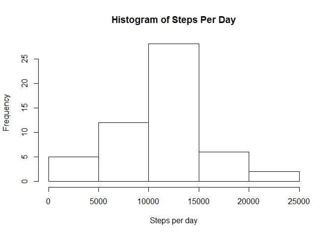
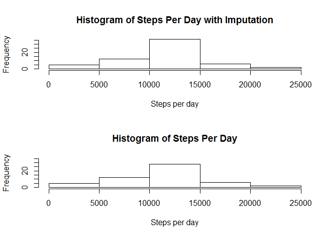
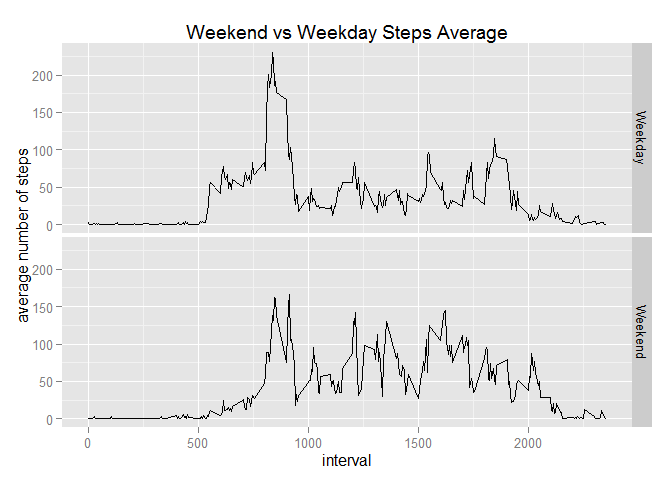

# Reproducible Research: Peer Assessment 1


## Loading and preprocessing the data

The libraries used in this experiment are as follows:

```r
library(dplyr)
library(ggplot2)
```


We will read in the csv file and convert the date column from character to the `Date` format in R. This
conversion is needed for the analysis at a later stage.


```r
activityDataSet <- read.csv(unz("activity.zip", "activity.csv"))
activityDataSet$date <- as.Date(as.character(activityDataSet$date), format = "%Y-%m-%d")
```


## What is mean total number of steps taken per day?

We will calculate the total number of steps per day and then plot a histogram.


```r
totalStepsPerDay <-
  activityDataSet %>%
  filter(!is.na(steps)) %>%
  group_by(date) %>% 
  summarise(sumPerDay = sum(steps))
hist(totalStepsPerDay$sumPerDay, main="Histogram of Steps Per Day", xlab="Steps per day")
```

 

The mean steps per day is 10766.19 and the median is 10765.

## What is the average daily activity pattern?

The average daily activity pattern can be found below:

```r
averageStepsPerInterval <-
  activityDataSet %>%
  filter(!is.na(steps)) %>%
  group_by(interval) %>% 
  summarise(meanPerInterval = mean(steps))
ggplot(averageStepsPerInterval, aes(interval, meanPerInterval)) +
  geom_line() +
  xlab("Interval") + ylab("Steps")
```

 

The interval with the highest number of steps is 835.

## Imputing missing values
The total number of NAs in this dataset is 2304. For imputation we're going to replace all the NA values with the average number of steps taken per interval over all days:


```r
fixedActivityDataSet <- activityDataSet[,]
indicesToReplace <- which(is.na(fixedActivityDataSet))
valueToReplace <- 
  sapply(indicesToReplace, 
         function(i) subset(averageStepsPerInterval, interval == fixedActivityDataSet[i,3])$meanPerInterval)
fixedActivityDataSet$steps <- replace(fixedActivityDataSet$steps, indicesToReplace, valueToReplace)
totalStepsPerDayWithImputation <-
  fixedActivityDataSet %>%
  group_by(date) %>% 
  summarise(sumPerDay = sum(steps))
```


The plot below compares steps per day with or without the above imputation method.

```r
par(mfrow=c(2,1))
hist(totalStepsPerDayWithImputation$sumPerDay, main="Histogram of Steps Per Day with Imputation", xlab="Steps per day", ylim=c(0,35))
hist(totalStepsPerDay$sumPerDay, main="Histogram of Steps Per Day", xlab="Steps per day", ylim=c(0,35))
```

 

```r
par(mfrow=c(1,1)) 
```

The results show that by averaging the intervals per all days available we have effectively added a day with +10000 steps(actual value is 10766.189) to the dataset and that has resulted in the histogram showing higher frequency for the days over 10000 steps. 

## Are there differences in activity patterns between weekdays and weekends?

Let's plot the steps taken per day and compare them on weekend vs weekdays:


```r
fixedActivityDataSet <- fixedActivityDataSet %>%
                        mutate(dayType = 
                          factor(
                            ifelse((weekdays(date) == "Saturday" | weekdays(date) == "Sunday"), 
                                    "Weekend", 
                                    "Weekday"), 
                          levels=c("Weekday", "Weekend")))
fixedAverageStepsPerInterval <- fixedActivityDataSet %>%
                                 group_by(interval, dayType) %>%
                                 summarise(meanPerInterval = mean(steps))


ggplot(fixedAverageStepsPerInterval, aes(interval, meanPerInterval)) + 
  geom_line() + 
  facet_grid(dayType~.) + 
  ggtitle("Weekend vs Weekday Steps Average") + xlab("interval") + ylab("average number of steps")
```

 

The results,as expected, show more variability throughout the day in the number of steps because of the subject probabaly walking around more as opposed to sitting down. Also there is a noticable contrast in the commute time in a weekday where the steps taken increase dramatically.
